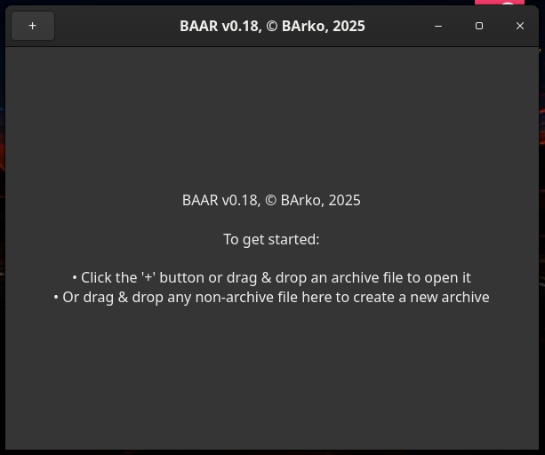

<p align="center">
    
</p>

Experimental project - use at your own risk.

Note: Significant portions of this project were generated and iteratively developed with assistance from AI under the direction and guidance of the repository owner. The owner reviewed, tested, and approved the code and design decisions. This project remains experimental - use at your own risk.

BAAR is a lightweight archiver implemented in C. The primary interface is a command-line (CLI) tool with an optional GTK4-based GUI frontend. The CLI is feature-complete and is the authoritative interface for scripting and automation; the GUI offers an interactive view with drag & drop, browsing, and common archive operations.

IMPORTANT: The content below documents the CLI behavior (actual implemented commands and options) and describes the GUI features in detail. The CLI documentation reflects the implemented behavior in the source code.

## What's new

- Compact CLI progress output: when running compact CLI flows (default non-verbose mode), filenames are shown as a basename together with a percentage in parentheses, for example:

    ./baar a my.baar file1.txt
    Adding files: file1.txt (32%)

    This keeps the CLI compact and suitable for terminals where space is limited. Verbose mode (or `--verbose`) retains full path output and an activity spinner.

- Owner restoration on extract (root-only): when extracting as root (`sudo`), BAAR restores stored file ownership (uid/gid) from the archive. When extracting as a regular user, files are created with the extracting user's ownership.
    - This applies to both the native `.baar` format and libarchive-based reads (ZIP/TAR) where stored uid/gid information is available. For libarchive extraction the program sets owner restoration flags when run as root.

- Installation: `make install` honors `PREFIX` and `DESTDIR`, suitable for packaging and installing directly under `/usr`.

## Command-line (CLI) usage

The CLI supports the following subcommands and options (exact behavior implemented in `src/baar.c`):

- Add files / create archive:
    - `baar a <archive> [files...] [-c 0|1|2|3|4] [-p password]`
        - Add files or directories to `<archive>` (the `.baar` extension is appended if missing).
        - Files may be specified as `src:dst` to control the path inside the archive.
        - Per-file compression level may also be provided using `src:level` style.
        - `--incremental` (or `-i`): Only add new or changed files. Existing files in the archive are left untouched, even if they are missing from the source.
        - `--mirror` (or `-m`): Mirror mode. In addition to incremental behavior, any files present in the archive but missing from the source are marked as deleted (logical removal). The archive becomes a mirror of the source directory.
        - You can combine both options: `--incremental --mirror` (or `-i -m`). Mirror mode always implies incremental behavior.
        - `--ignore <pattern>`: Skip files, directories, or archive paths matching the provided shell-style glob. You can repeat this option multiple times.
        - Files that cannot be read (for example due to missing permissions) are reported and left untouched.

#### Examples for incremental and mirror modes

Add or update only new/changed files (incremental):
```sh
./baar a my.baar mydir --incremental
# or using the short option:
./baar a my.baar mydir -i
```

Mirror the source directory (add/update new/changed, mark missing as deleted):
```sh
./baar a my.baar mydir --incremental --mirror
# or using short options:
./baar a my.baar mydir -i -m
```

If you use only `--mirror`/`-m` without `--incremental`/`-i`, the effect is the same as using both (mirror always implies incremental mode).

Ignore glob-matching files while archiving:
```sh
./baar a my.baar src --ignore "*.tmp" --ignore "build/*"
```

- Extract archive:
    - `baar x <archive> [dest_dir] [-p password]`
        - Extract all files from `<archive>` into `dest_dir` (current directory if omitted).
        - When run as root (for example with `sudo`), BAAR attempts to restore the original ownership (uid/gid) stored in the archive. When executed as a regular user, extracted files are created using the extracting user's ownership.
                - Example (owner restoration when run as root):
                    ```sh
                    sudo ./baar x my.baar ./out
                    ls -l ./out
                    # files previously owned by root inside the archive will be restored as root-owned here
                    ```

- List contents:
    - `baar l <archive> [-j|--json]`
        - List entries in human-readable form or JSON when `-j/--json` is used.

- Test integrity:
    - `baar t <archive> [-p password] [-j|--json]`
        - Decompress and CRC-check all entries to verify integrity.

- Repair / rebuild:
    - `baar f <archive>`
        - Rebuilds the archive, removing deleted or removed entries and compacting storage.

- Remove entry by id:
    - `baar r <archive> <id>`
        - Marks the entry with numeric id as deleted (logical removal).

- Search entries:
    - `baar search <archive> <pattern> [-j|--json]`
        - Search by name using shell wildcard patterns (`*`, `?`).

- Show entry metadata:
    - `baar info <archive> <id> [-j|--json]`
        - Display metadata for the entry with numeric id.

- Print entry contents to stdout:
    - `baar cat <archive> <id> [-p password]`

- Extract a single file by archive path:
    - `baar xx <archive> <entry_name> [-p password]`
        - Extracts the named entry (by path inside archive) to the current working directory.

- Create directory entry inside archive:
    - `baar mkdir <archive> path/to/dir`

- Rename an entry:
    - `baar rename <archive> <id> <new_name>`

- Recompress entries safely:
    - `baar compress <archive> -c 0|1|2|3|4 [-p password]`
        - Recompresses entries using the requested level (0=store, 1=fast, 2=balanced, 3=best, 4=ultra).

Notes on options and behavior:

- Compression levels: `-c 0`..`-c 4` (0 = store, 1 = fast, 2 = balanced, 3 = best, 4 = ultra).
- Password/encryption: `-p password` enables PBKDF2-derived stream XOR protection (PBKDF2 + HMAC-SHA256 keystream). The program validates passwords using CRC before writing extracted files. Legacy XOR compatibility mode can be enabled with the environment variable `BAAR_LEGACY_XOR=1`.
- JSON output: `-j` or `--json` yields machine-readable JSON for commands that support it (listing, testing, search, info).
- The archive format stores file data blobs first and an index at the end; the header contains an index offset. Deleting entries marks them as deleted; `f` (rebuild) rewrites a compacted archive.

Examples:

```
./baar a my.baar file1.txt file2.png -c 1
./baar l my.baar
./baar x my.baar ./out -p secret
./baar t my.baar -p secret
./baar r my.baar 3
./baar f my.baar
./baar --gui                    # Launch GUI (interactive)
./baar --gui my.baar            # Launch GUI and open archive
```

### CLI progress output (compact / verbose)

- Compact CLI: By default, in non-verbose CLI mode BAAR prints progress compactly by showing only the base filename followed immediately by the percentage in parentheses, for example:

    Adding files: file1.txt (32%)

    This format keeps the CLI output short and readable on narrow terminals.
- Verbose CLI: Use `--verbose` or environment variable `BAAR_VERBOSE=1` to show full paths and a spinner with richer status text.


## GUI (GTK4) — detailed description

The GUI is an optional frontend implemented with GTK4. It provides an interactive archive browser and common operations. The GUI mirrors many CLI operations but is intended for manual interaction rather than automation. The GUI mode is enabled with `--gui`.

High-level GUI features and user interactions:

    - Window and main layout:
        - When no archive is open, the GUI shows a simple welcome screen and toolbar with a `+` (open/create) button. When an archive is opened the main pane shows a list of entries (a `GtkListBox`) and an information panel on the right with selected-entry details (name, size, number of entries).

    - Opening/creating archives:
        - Use the `+` control to open an existing archive file or to create a new `.baar` archive. If a user drops a `.baar` file onto the window when no archive is open, the GUI will open that archive.

    - Browsing and navigation:
        - The archive view supports folder-style navigation. Virtual folders are provided for libarchive formats (ZIP/TAR) where explicit directory entries may be missing; double-clicking a folder drills down and a `..` parent row is shown to go up one level. The current folder prefix is tracked internally and the list is populated by filtering the loaded index.

    - Adding files and directories:
        - With an archive open, click the add (`+`) button in the toolbar to add files or directories. Files may also be dropped onto the open archive window to add them.
        - The GUI supports recursive collection of files when adding directories.

    - Removing entries and compacting:
        - Select entries and click the `-` button to mark them as deleted. Deleted entries remain in the archive until a rebuild/compact operation (`Compact` / `Refresh`) is invoked; `Compact` will rebuild the archive excluding deleted entries.

    - Extracting files:
        - Select one or more entries and click the extract/save icon. The GUI will extract the selected entries to a destination chosen by the user. When dragging files out to the file manager (external drag), files are temporarily extracted to a per-process temporary directory such as `/tmp/baar_drag_<pid>/` and provided to the desktop as regular files for the drag operation.
        - If the GUI is running with elevated privileges (for example when invoked as root), BAAR will attempt to restore original ownership (uid/gid) for extracted files where stored in the archive.

    - Drag & drop behavior (bidirectional):
        - Drag IN (into BAAR):
            - Dropping a `.baar` archive onto the application when no archive is open will open that archive.
            - Dropping files onto an already-open archive will add those files to the current archive (the user may be prompted for overwrite behavior if conflicts occur).
            - Dropping files when no archive is open will prompt the user to create a new archive and then add the files.

    - Drag OUT (from BAAR to file manager):
        - Dragging file rows from the archive view to an external file manager causes temporary extraction of the selected entries into a `/tmp/baar_drag_<pid>/` folder and supplies those files to the drag operation. Only file entries are supported for external drag; folders are not provided as a single droppable item.

    - Internal drag & drop and moving entries:
        - The GUI implements internal drag & drop targets for moving items between folders inside BAAR (for the native `.baar` format). Internal moves are performed without extracting full file contents to the filesystem.

    - Encryption and password handling in the GUI:
        - If an archive is encrypted or the user provides a `-p` password via the CLI when opening the GUI, the GUI stores a password in memory for operations that require decryption/encryption. When adding files to an encrypted archive the GUI will encrypt them with the current archive password. On certain drag operations the user may be asked whether to encrypt dropped data.

    - Progress reporting and dialogs:
        - Long-running operations (add, extract, rebuild) display a progress dialog with a progress bar and descriptive text. Operations are run asynchronously so the UI remains responsive.

    - Entry metadata and info panel:
        - Selecting a row shows metadata like uncompressed size, compressed size, CRC, compression level, and POSIX-like attributes (mode, uid, gid, mtime) in the info panel.

## Building and installation

Build with make (requires development packages listed below):

```
make
```

Install to system locations:

By default `make install` installs files under the chosen prefix (default: `/usr`).
You can override the prefix like this: `sudo make PREFIX=/usr/local install`.

Typical install destinations (where `${PREFIX}` defaults to `/usr`):

- Binary:
    - ${PREFIX}/bin/baar
- Desktop entry (desktop file):
    - ${PREFIX}/share/applications/baar.desktop
- AppStream / metainfo (if present):
    - ${PREFIX}/share/metainfo/baar.xml
- Man pages (if provided by the build):
    - ${PREFIX}/share/man/man1/baar.1
- Icons and other shared data (only if the project provides them):
    - ${PREFIX}/share/icons/hicolor/<size>/apps/
    - ${PREFIX}/share/icons/...

Install / uninstall commands:

```
# Install the built binary and resources to system locations (default: /usr)
sudo make install

# To install into a different prefix (for example /usr/local), and using DESTDIR for packaging:
sudo make PREFIX=/usr/local install

# To install into a staging directory for packaging (recommended for building packages):
sudo make PREFIX=/usr/local DESTDIR=/tmp/tmpinst install

# To uninstall the files previously installed by `make install` (matches PREFIX used for install):
sudo make PREFIX=/usr/local uninstall
```

### Requirements (development packages)

- C compiler (gcc or clang)
- make
- zlib development libraries (e.g. `zlib1g-dev` on Debian/Ubuntu)
- libarchive development libraries (e.g. `libarchive-dev` on Debian/Ubuntu)
- GTK4 development libraries (for GUI, e.g. `libgtk-4-dev` on Debian/Ubuntu)

### Debian/Ubuntu example

```sh
sudo apt update
sudo apt install build-essential zlib1g-dev libarchive-dev libgtk-4-dev
```

## Running

Show help (CLI):

```sh
./baar --help
```

Run GUI:

```sh
./baar --gui
```

## Notes and implementation details

- Password protection: PBKDF2 (100k iterations) + HMAC-SHA256 is used to derive a pseudorandom keystream which is XORed with data blocks for simple stream encryption. CRC checks are used to detect incorrect passwords. For legacy compatibility a mode using an older XOR approach can be enabled with `BAAR_LEGACY_XOR=1`.
- Archive layout: data blobs are written first and a JSON-like index is written at the end; the header contains a pointer to the index offset. This enables the CLI to quickly read the index from the end of the file.
- Limitations: there is no authenticated encryption (no MAC/AES-GCM), some extended metadata may not be preserved, and rebuilding very large archives can be slow because the index is at the end.

## Build & Test Status (local)

- Build: PASS (compiled with gcc, small warning about an unused helper)
- Basic tests: PASS (create, list, test, extract, remove, rebuild, password)

